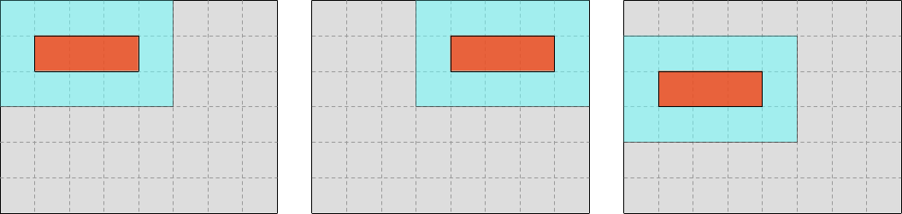
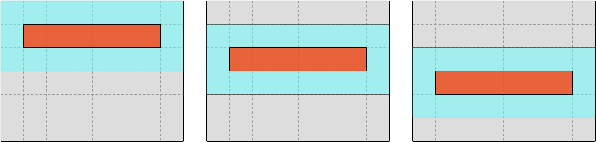
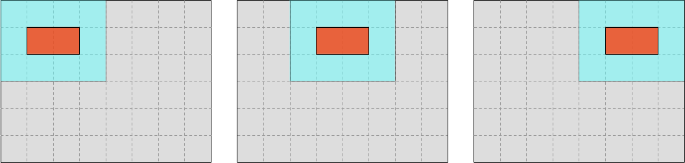

# Basic SIMD

By now, we have largely resolved the slicing-induced performance bottleneck that
plagued our initial naive simulation code. But as we have seen in the
introductory chapters, there is still much to do before our Rust code puts
hardware to good use.

In particular, we are not using SIMD yet, for reasons that will become clear
once you realize that we are effectively computing one tiny dot product per
output concentration value. As you know from earlier chapters of this course,
compilers cannot translate naive dot product computations into efficient SIMD
code, we must perform the translation for them.

This is the first thing that we will need to fix in order to use our hardware
more efficiently.


## Picking a granularity

This computation is complex enough that there are actually two different ways to
vectorize it:

1. We could try to internally vectorize the computation of a single (u, v) 
   concentration value pair. The diffusion gradient computation, which is
   basically a dot product, would be an obvious candidate for vectorization as
   we already know how to compute SIMD dot products.
2. On each iteration of the loop, we could try to compute not just one pair of
   concentration values, but one full SIMD vector of concentration values for
   each chemical species. Basically, anywhere the current code manipulates a
   single floating-point number, the new code would manipulate a full SIMD
   vector of floating-point numbers instead.

Are there any reasons to prefer one of these two options over the other? Indeed
there are:

- Option 1 only lets us vectorize a subset of the computation, while option 2
  lets us vectorize the full computation. Because [Amdhal's
  law](https://en.wikipedia.org/wiki/Amdahl%27s_law) is a thing, this is an
  argument in favor of option 2.
- Option 1 involves performing SIMD horizontal reductions (going from a SIMD
  vector of inputs to a single floating-point output) in a tight loop. In
  contrast, option 2 involves no horizontal reduction. Because horizontal
  reductions are slow, this is an argument in favor of option 2.
- Option 2 only makes sense if the entire computation is done using SIMD. This
  will consume more SIMD execution resources (CPU SIMD registers, etc) and make
  our life difficult in the presence of constructs that do not map well to SIMD
  like `if/else` and loop early exits. Therefore, on certain hardware
  architectures or for sufficiently complex code, only option 1 (fine-grained
  SIMD) may be available.

In this school, we are using x86 CPUs, which perform scalar floating-point
operations using the same CPU resources as SIMD operations. Therefore, switching
to SIMD will not change the CPU resource usage profile, and there is no risk of
blowing a CPU hardware budget that we used to fit in before.

And on the code side, our computation is simple enough that translating it to
SIMD operations is not super-difficult. So overall, for this computation, option
2 (coarse-grained SIMD) is the clear winner.


## Visualizing the goal

As it turns out, the simplest way we can go about introducing SIMD in this
computation is to make our input and output windows wider, as we will now
visually demonstrate.

Currently, we are jointly iterating over input windows and output values as in
the following sketch...


...where the gray rectangle represents the overall dataset, the blue square
represents the location of the input values that we are reading at each step of
the update loop, and the red square represents the location of the output value
that we are writing at each step of the update loop.

Our goal in this chapter will be to instead iterate over wider (but equally
high) input and output slices, where the output region is as wide as a hardware
SIMD vector, and the input region follows by adding one data point on each side.



Once we get there, introducing SIMD will "just" be a matter of replacing each
scalar operation in our algorithm with a SIMD operation that targets a SIMD 
vector starting at the same memory location.


## Breaking the symmetry

This move to wider input and output windows is not without consequences,
however. It breaks the symmetry between rows and columns that has existed so far
in our computation, allowing us to perform 2D iteration over the dataset with a
single, 1D-feeling loop.

Now we are going to need an outer loop over lines of output...



...and, under that outer loop, an inner loop over SIMD vectors within each line.



We are also going to need to decide how to handle the case where the number of
output elements within a line is not a multiple of the SIMD vector length:

1. Do we simply forbid this to keep our code simple, at the cost of making users
   angry?
2. Do we handle the remaining elements of each line using a scalar computation?
3. Do we start by slicing up a "regular" part of the computation that has all
   the right properties for SIMD, processing the rest (including the edges of
   the simulation domain) using a more general but slower scalar implementation?

There is no single right answer here, and the right way to go about this will
depend on the technical and political specifics of the software that you are
writing. But option 3 is a good tradeoff if you are unsure, and may therefore be
a good starting point.


## The "easy" part

We will now start implementing a subset of the update loop that only works on
the part of the simulation domain that is easy to handle using SIMD.

First of all, assuming a pre-existing `SIMD_WIDTH` constant which contains our
SIMD vector width, we can select an output region that covers all previous
output rows, but only a number of columns that corresponds to an integer number
of SIMD vectors:

```rust,ignore
use ndarray::s;

let [num_rows, num_cols] = start.shape();
let num_regular_cols = ((num_cols - 2) / SIMD_WIDTH) * SIMD_WIDTH;

let regular_output = s![1..(num_rows - 1), 1..=num_regular_cols];
let mut regular_out_u = end.u.slice_mut(regular_output);
let mut regular_out_v = end.v.slice_mut(regular_output);

let regular_input = s![0..num_rows, 0..=(num_regular_cols + 1)];
let regular_in_u = start.u.slice(regular_input);
let regular_in_v = start.v.slice(regular_input);
```

We can then iterate over rows of the output arrays and the corresponding
windows of three consecutive input rows in the input arrays...

```rust,ignore
use ndarray::Axis;

let out_rows = (regular_out_u.rows_mut().into_iter()).zip(regular_out_v.rows_mut());

let in_windows = (regular_in_u.axis_windows(Axis(0), 3).into_iter())
    .zip(regular_in_v.axis_windows(Axis(0), 3));

// Cannot use `ndarray::azip` here because it does not support jointly
// iterating over ArrayViews of different dimensionality (here 1D and 2D)
for ((mut out_row_u, mut out_row_v), (win_u, win_v)) in out_rows.zip(in_windows) {
    // TODO: Process a row of output here
}
```

...and within that outer loop, we can have an inner loop on SIMD-sized chunks
within each row of the output matrix, along with the corresponding input windows.


```rust,ignore
let out_chunks = (out_row_u.exact_chunks_mut(SIMD_WIDTH).into_iter())
    .zip(out_row_v.exact_chunks_mut(SIMD_WIDTH));

let in_windows = (win_u
    .axis_windows(Axis(1), SIMD_WIDTH + 2)
    .into_iter()
    .step_by(SIMD_WIDTH))
.zip(
    win_v
        .axis_windows(Axis(1), SIMD_WIDTH + 2)
        .into_iter()
        .step_by(SIMD_WIDTH),
);

// Cannot use `ndarray::azip` here for the same reason as before
for ((mut out_chunk_u, mut out_chunk_v), (win_u, win_v)) in out_chunks.zip(in_windows) {
    // TODO: Process a SIMD-sized chunk of output here
}
```

Finally, within the body of that inner loop, we can introduce a SIMD version of
our regularized update algorithm, using `std::simd`:

```rust,ignore
use crate::data::Float;
use std::simd::prelude::*;

// Access the SIMD data corresponding to the center concentration
let simd_input = s![
    STENCIL_OFFSET[0],
    STENCIL_OFFSET[1]..SIMD_WIDTH + STENCIL_OFFSET[1],
];
let u = win_u.slice(simd_input);
let v = win_v.slice(simd_input);

// Load it as a SIMD vector
//
// The conversion from ArrayView to slice can fail if the data is
// not contiguous in memory. In this case, we know it should always
// be contiguous, so we can use unwrap() which panics otherwise.
type Vector = Simd<Float, SIMD_WIDTH>;
let u = Vector::from_slice(u.as_slice().unwrap());
let v = Vector::from_slice(v.as_slice().unwrap());

// Compute the diffusion gradient for U and V
let [full_u, full_v] = (win_u.windows([1, SIMD_WIDTH]).into_iter())
    .zip(win_v.windows([1, SIMD_WIDTH]))
    .zip(STENCIL_WEIGHTS.into_iter().flatten())
    .fold(
        [Vector::splat(0.); 2],
        |[acc_u, acc_v], ((stencil_u, stencil_v), weight)| {
            let stencil_u = Vector::from_slice(stencil_u.as_slice().unwrap());
            let stencil_v = Vector::from_slice(stencil_v.as_slice().unwrap());
            let weight = Vector::splat(weight);
            [
                acc_u + weight * (stencil_u - u),
                acc_v + weight * (stencil_v - v),
            ]
        },
    );

// Compute SIMD versions of all the float constants that we use
let diffusion_rate_u = Vector::splat(DIFFUSION_RATE_U);
let diffusion_rate_v = Vector::splat(DIFFUSION_RATE_V);
let feedrate = Vector::splat(opts.feedrate);
let killrate = Vector::splat(opts.killrate);
let deltat = Vector::splat(opts.deltat);
let ones = Vector::splat(1.0);

// Compute the output values of u and v
let uv_square = u * v * v;
let du = diffusion_rate_u * full_u - uv_square + feedrate * (ones - u);
let dv = diffusion_rate_v * full_v + uv_square - (feedrate + killrate) * v;
let out_u = u + du * deltat;
let out_v = v + dv * deltat;

// Store the output values of u and v
out_u.copy_to_slice(out_chunk_u.as_slice_mut().unwrap());
out_v.copy_to_slice(out_chunk_v.as_slice_mut().unwrap());
```

The main highlights here are that

- We can convert back from an `ArrayView` that has contiguous storage to a
  standard Rust slice for the purpose of interacting with the SIMD API, which
  doesn't know about `ndarray`.
- We can still use 1D-like iteration in our inner diffusion gradient loop, it is
  only the outer loops on output elements that are affected by the change of
  algorithm.
- Floating point constants can be turned into SIMD vectors whose elements are
  all equal to the constant by using `Simd::splat`, which on x86 maps to the
  hardware `broadcastss` instruction.
- Adding SIMD to any nontrivial codebase without turning it into an unreadable
  mess is a major software engineering challenge[^1].

Finally, because we are using the experimental nightly-only `std::simd` API, we
will need to enable it by adding the associated `#![feature(portable_simd)]`
directive to the top of `exercises/src/lib.rs` (assuming this is where you have
put the update function's implementation).


## Exercise

Make a backup of your current update function, you will need some of it to
handle the irregular subset of the data (simulation domain edges, extra columns
that do not fit a SIMD vector nicely, etc).

Then integrate the above regularized SIMD algorithm into your code, and complete
it by adding function multiversioning through the `multiversion` crate (as
presented in the [SIMD chapter](08-victor.md)), so that you get something to put
inside of this `SIMD_WIDTH` constant:

```rust,ignore
const SIMD_WIDTH: usize = ...;
```

Finally, make your update function handle the irregular part of the simulation
domain by reusing your former implementation.


---

[^1]: Though we will see in the next chapter that SIMD can be made both easier
      and more efficient, if we are willing to sacrifice any hope of
      interoperability with other code and rearrange data into a highly
      non-obvious layout.
