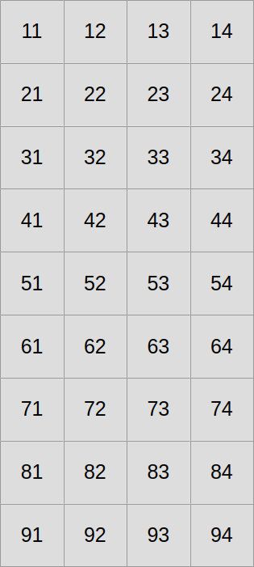
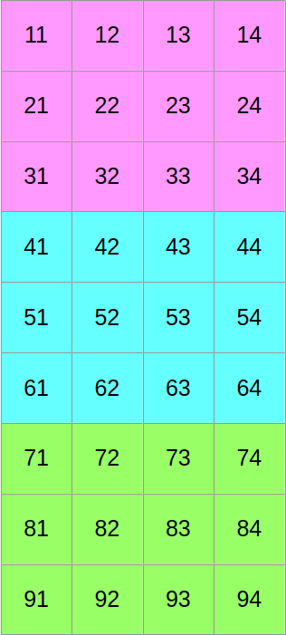
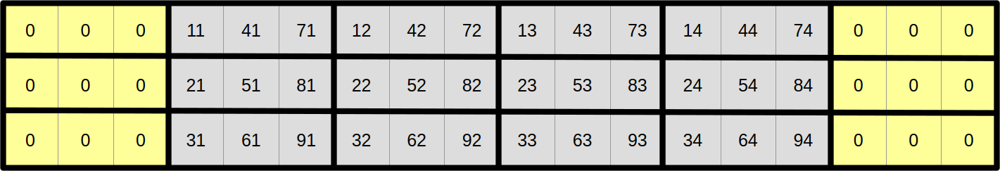
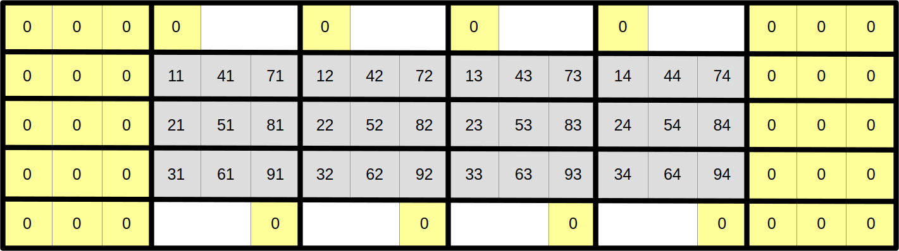
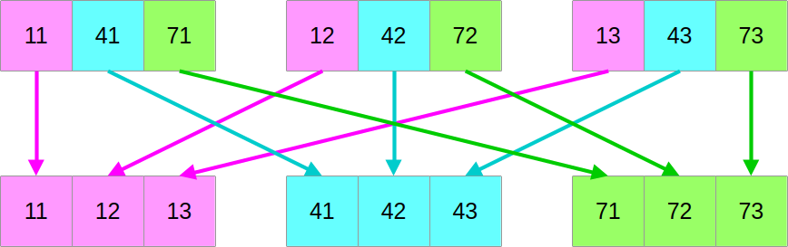

# Advanced SIMD

The SIMD version of the Gray-Scott simulation that we have implemented in the
previous chapter has two significant issues that would be worth improving upon:

- The SIMD update loop is significantly more complex than the [regularized
  scalar version](13-regulations.md).
- Its memory accesses suffer from alignment issues that will reduce runtime
  performance. On x86 specifically, at least 1 in 4 memory access[^1] will be
  slowed down in SSE builds, 1 in 2 in AVX builds, and every memory access is in
  AVX-512 builds. So the more advanced your CPU's SIMD instruction set, the
  worse the relative penalty becomes.

Interestingly, there is a way to improve the code on both of these dimensions,
and simplify the update loop immensely while improving its runtime performance.
However, there is no free lunch in programming, and we will need to pay a
significant price in exchange for these improvements:

- The layout of numerical data in RAM will become less obvious and harder to
  reason about.
- Interoperability with other code that expects a more standard memory layout,
  such as the HDF5 I/O library, will become more difficult and have higher
  runtime overhead.
- We will need to give up on the idea that we can allow users to pick a
  simulation domain of any size they like, and enforce some hardware-originated
  constraints on the problem size.

Assuming these are constraints that you can live with, let us now get started!


## A new data layout

So far, we have been laying out our 2D concentration data in the following
straightforward manner:

<center></center>

Now let us assume that we want to use SIMD vectors of width 3. We will start by
slicing our scalar data into three equally tall horizontal slices, one per SIMD
vector lane...

<center></center>

...and then we will shuffle around the data such that if we read it from left to
right, we now get the first column of the former top block, followed by the
first column of the middle block, followed by the first column of the bottom
block, followed by the second column of the top block, and so on:


At this point, you may reasonably be skeptical that this is an improvement. But
before you start doubting my sanity, let us look at the same data layout again,
with a different visualization that emphasizes aligned SIMD vectors:


And now, let us assume that we want to compute the output aligned SIMD vector at
coordinate (1, 1) from the top-left corner in this SIMD super-structure:


As it turns out, we can do it using a read and write pattern that looks exactly
like the regularized scalar stencil that we have used before, but this time
using correctly aligned SIMD vectors instead of scalar data points. Hopefully,
by now, you will agree that we are getting somewhere.

Now that we have a very efficient data access pattern at the center of the
simulation domain, let us reduce the need for special edge handling in order to
make our simulation update loop even simpler. The left and right edges are easy,
as we can just add zeroed out vectors on both sides and be careful not to
overwrite them later in the computation...



...but the top and bottom edges need more care. The upper neighbours of scalar
elements at coordinates 1x is 0 and the lower neighbours of scalar elements at
coordinates 9x are easy because they can also be permanently set to zero:



However, other top and bottom scalar elements will somehow need to wrap around
the 2D array and shift by one column in order to access their upper and lower
neighbors:


There are several ways to implement this wrapping around and column-shifting in
a SIMD computation. In this course, we will use the approach of updating the
upper and lower rows of the array after each computation step in order to keep
them in sync with the matching rows at the opposite end of the array. This
wrapping around and shifting will be done using an advanced family of SIMD
instructions known as _swizzles_.

Even though SIMD swizzles are relatively expensive CPU instructions, especially
on x86, their overhead will be imperceptible for sufficiently tall simulation
domains. That's because we will only need to use them in order to update the top
and bottom rows of the simulation, no matter how many rows the simulation domain
has, whereas the rest of the simulation update loop has a computational cost
that grows linearly with the number of simulation domain rows.


## Adjusting the code

Data layout changes can be an extremely powerful tool to optimize your code. And
generally speaking there will always be a limit to how much performance you can
gain without changing how data is laid out in files and in RAM.

But the motto of this course is that there is no free lunch in programming, and
in this particular case, the price to pay for this change will be a major code
rewrite to adapt almost every piece of code that we have previously written to
the new data layout.[^2]

### U and V concentration storage

Our core `UV` struct has so far stored scalar data, but now we will make it
store SIMD vectors instead. We want to do it for two reasons:

- It will make our SIMD update loop code much simpler and clearer.
- It will tell the compiler that we want to do SIMD with a certain width and the
  associated memory allocation should be correctly aligned for this purpose.

The data structure definition therefore changes to this:

```rust,ignore
use std::simd::{prelude::*, LaneCount, SupportedLaneCount};

/// Type alias for a SIMD vector of floats, we're going to use this type a lot
pub type Vector<const SIMD_WIDTH: usize> = Simd<Float, SIMD_WIDTH>;

/// Storage for the concentrations of the U and V chemical species
pub struct UV<const SIMD_WIDTH: usize>
where
    LaneCount<SIMD_WIDTH>: SupportedLaneCount,
{
    pub u: Array2<Vector<SIMD_WIDTH>>,
    pub v: Array2<Vector<SIMD_WIDTH>>,
}
```

Notice that the `UV` struct definition must now be generic over the SIMD vector
width (reflecting the associated change in memory alignement in the underlying
`Array2`s), and that this genericity must be _bounded_ by a `where` clause[^3]
to indicate that not all `usize`s are valid SIMD vector widths.[^4]

---

The methods of the `UV` type change as well, since now the associated `impl`
block must be made generic as well, and the implementation of the various
methods must adapt to the fact that now our inner storage is made of SIMD
vectors.

First the `impl` block will gain generics parameters, with bounds that match
those of the source type:

```rust,ignore
impl<const SIMD_WIDTH: usize> UV<SIMD_WIDTH>
where
    LaneCount<SIMD_WIDTH>: SupportedLaneCount,
{
    // TODO: Add methods here
}
```

The reason why the `impl` blocks needs generics bounds as well is that this
gives the language syntax headroom to let you add methods that are specific to
one specific value of the generics parameters, like this:

```rust,ignore
impl UV<4> {
    // TODO: Add code specific to vectors of width 4 here
}
```

That being said, repeating bounds like this is certainly annoying in the common
case, and there is a longstanding desire to add a way to tell the language
"please just repeat the bounds of the type definitions", using syntax like this:

```rust,ignore
impl UV<_> {
    // TODO: Add generic code that works for all SIMD_WIDTHS here
}
```

The interested reader is advised to use "implied bounds" as a search engine
keyword, in order to learn more about how this could work, and why integrating
this feature into Rust has not been as easy as initially envisioned.

---

The main `UV::new()` constructor changes a fair bit because it needs to account
for the fact that...

1. There is now one extra SIMD vector on each side of the simulation domain
2. The SIMD-optimized data layout is quite different, and mapping our original
   rectangular concentration pattern to it is non-trivial.
3. To simplify this version of the code, we set the constraint that both the
   height and the width of the simulation domain must be a multiple of the SIMD
   vector width.

...which, when taken together, leads to this implementation:

```rust,ignore
fn new(num_scalar_rows: usize, num_scalar_cols: usize) -> Self {
    // Enforce constraints of the new data layout
    assert!(
        (num_scalar_rows % SIMD_WIDTH == 0) && (num_scalar_cols % SIMD_WIDTH == 0),
        "num_scalar_rows and num_scalar_cols must be a multiple of the SIMD vector width"
    );
    let num_center_rows = num_scalar_rows / SIMD_WIDTH;
    let simd_shape = [num_center_rows + 2, num_scalar_cols + 2];

    // Predicate which selects central rows and columns
    let is_center = |simd_row, simd_col| {
        simd_row >= 1
            && simd_row <= num_center_rows
            && simd_col >= 1
            && simd_col <= num_scalar_cols
    };

    // SIMDfied version of the scalar pattern, based on mapping SIMD vector
    // position and SIMD lane indices to equivalent positions in the
    // original scalar array.
    //
    // Initially, we zero out all edge elements. We will fix the top/bottom
    // elements in a later step.
    let pattern = |simd_row, simd_col| {
        let elements: [Float; SIMD_WIDTH] = if is_center(simd_row, simd_col) {
            std::array::from_fn(|simd_lane| {
                let scalar_row = simd_row - 1 + simd_lane * num_center_rows;
                let scalar_col = simd_col - 1;
                (scalar_row >= (7 * num_scalar_rows / 16).saturating_sub(4)
                    && scalar_row < (8 * num_scalar_rows / 16).saturating_sub(4)
                    && scalar_col >= 7 * num_scalar_cols / 16
                    && scalar_col < 8 * num_scalar_cols / 16) as u8 as Float
            })
        } else {
            [0.0; SIMD_WIDTH]
        };
        Vector::from(elements)
    };

    // The next steps are very similar to the scalar version...
    let u = Array2::from_shape_fn(simd_shape, |(simd_row, simd_col)| {
        if is_center(simd_row, simd_col) {
            Vector::splat(1.0) - pattern(simd_row, simd_col)
        } else {
            Vector::splat(0.0)
        }
    });
    let v = Array2::from_shape_fn(simd_shape, |(simd_row, simd_col)| {
        pattern(simd_row, simd_col)
    });
    let mut result = Self { u, v };

    // ...except we must fix up the top and bottom rows of the simulation
    // domain in order to achieve the intended data layout.
    result.update_top_bottom();
    result
}
```

Notice the call to the new `update_top_bottom()` method, which is in charge of
calculating the top and bottom rows of the concentration array. We will get back
to how this method works in a bit.

---

The all-zeroes constructor changes very little in comparison, since when
everything is zero, the order of scalar elements within the array does not
matter:

```rust,ignore
/// Set up an all-zeroes chemical species concentration
fn zeroes(num_scalar_rows: usize, num_scalar_cols: usize) -> Self {
    // Same idea as above
    assert!(
        (num_scalar_rows % SIMD_WIDTH == 0) && (num_scalar_cols % SIMD_WIDTH == 0),
        "num_scalar_rows and num_scalar_cols must be a multiple of the SIMD vector width"
    );
    let num_simd_rows = num_scalar_rows / SIMD_WIDTH;
    let simd_shape = [num_simd_rows + 2, num_scalar_cols + 2];
    let u = Array2::default(simd_shape);
    let v = Array2::default(simd_shape);
    Self { u, v }
}
```

---

The notion of `shape` becomes ambiguous in the new layout, because we need to
clarify whether we are talking about the _logical_ size of the simulation domain
in scalar concentration data points, or its _physical_ size in SIMD vector
elements. Therefore, the former `shape()` method is split into two methods, and
callers must be adapted to call the right method for their needs:

```rust,ignore
/// Get the number of rows and columns of the SIMD simulation domain
pub fn simd_shape(&self) -> [usize; 2] {
    let shape = self.u.shape();
    [shape[0], shape[1]]
}

/// Get the number of rows and columns of the scalar simulation domain
pub fn scalar_shape(&self) -> [usize; 2] {
    let [simd_rows, simd_cols] = self.simd_shape();
    [(simd_rows - 2) * SIMD_WIDTH, simd_cols - 2]
}
```

---

...and finally, we get to discuss the process through which the top and bottom
rows of the SIMD concentration array are updated:

```rust,ignore
use multiversion::multiversion;
use ndarray::s;

// ...

/// Update the top and bottom rows of all inner arrays of concentrations
///
/// This method must be called between the end of a simulation update step
/// and the beginning of the next step to sync up the top/bottom rows of the
/// SIMD data store. It can also be used to simplify initialization.
fn update_top_bottom(&mut self) {
    // Due to a combination of language and compiler limitations, we
    // currently need both function multiversioning and genericity over SIMD
    // width here. See handouts for the full explanation.
    #[multiversion(targets("x86_64+avx2+fma", "x86_64+avx", "x86_64+sse2"))]
    fn update_array<const WIDTH: usize>(arr: &mut Array2<Vector<WIDTH>>)
    where
        LaneCount<WIDTH>: SupportedLaneCount,
    {
        // TODO: Implementation for one concentration array goes here
    }
    update_array(&mut self.u);
    update_array(&mut self.v);
}
```

First of all, we get this little eyesore of an inner function declaration:

```rust,ignore
#[multiversion(targets("x86_64+avx2+fma", "x86_64+avx", "x86_64+sse2"))]
fn update_array<const WIDTH: usize>(arr: &mut Array2<Vector<WIDTH>>)
where
    LaneCount<WIDTH>: SupportedLaneCount,
{
    // TODO: Top/bottom row update goes here
}
```

It needs to have a `multiversion` attribute AND a generic signature due to a
combination of language and compiler limitations:

- Rust currently does not allow inner function declarations to access the
  generic parameters of outer functions. Therefore, the inner function must be
  made generic over `WIDTH` even though it will only be called for one specific
  `SIMD_WIDTH`.
- Genericity over `SIMD_WIDTH` is not enough to achieve optimal SIMD code
  generation, because by default, the compiler will only generate code for the
  lowest-common-denominator SIMD instruction set (SSE2 on x86_64), emulating
  wider vector widths using narrower SIMD operations. We still need function
  multi-versioning in order to generate one optimized code path per supported
  SIMD instruction set, and dispatch to the right code path at runtime.

Beyond that, the implementation is quite straightforward. First we extract the
two top and bottom rows of the concentration array using `ndarray` slicing,
ignoring the leftmost and rightmost element that we know to be zero...

```rust,ignore
// Select the top and bottom rows of the simulation domain
let shape = arr.shape();
let [num_simd_rows, num_cols] = [shape[0], shape[1]];
let horizontal_range = 1..(num_cols - 1);
let row_top = s![0, horizontal_range.clone()];
let row_after_top = s![1, horizontal_range.clone()];
let row_before_bottom = s![num_simd_rows - 2, horizontal_range.clone()];
let row_bottom = s![num_simd_rows - 1, horizontal_range];

// Extract the corresponding data slices
let (row_top, row_after_top, row_before_bottom, row_bottom) =
    arr.multi_slice_mut((row_top, row_after_top, row_before_bottom, row_bottom));
```

...and then we iterate over all SIMD vectors within the rows, generating
"lane-shifted" versions using a combination of SIMD rotates and zero-assignment
(which have wider hardware support than lane-shifting), and storing them on the
opposite end of the array:

```rust,ignore
// Jointly iterate over all rows
ndarray::azip!((
    vec_top in row_top,
    &mut vec_after_top in row_after_top,
    &mut vec_before_bottom in row_before_bottom,
    vec_bottom in row_bottom
) {
    // Top vector acquires the value of the before-bottom vector,
    // rotated right by one lane and with the first element set to zero
    let mut shifted_before_bottom = vec_before_bottom.rotate_elements_right::<1>();
    shifted_before_bottom[0] = 0.0;
    *vec_top = shifted_before_bottom;

    // Bottom vector acquires the value of the after-top vector, rotated
    // left by one lane and with the last element set to zero
    let mut shifted_after_top = vec_after_top.rotate_elements_left::<1>();
    shifted_after_top[WIDTH - 1] = 0.0;
    *vec_bottom = shifted_after_top;
});
```

### Double buffering and the SIMD-scalar boundary

Because our new concentration storage has become generic over the width of the
SIMD instruction set in use, our double buffer abstraction must become generic
as well:

```rust,ignore
pub struct Concentrations<const SIMD_WIDTH: usize>
where
    LaneCount<SIMD_WIDTH>: SupportedLaneCount,
{
    buffers: [UV<SIMD_WIDTH>; 2],
    src_is_1: bool,
}
```

However, now is a good time to ask ourselves where we should put the boundary of
code which must know about this genericity and the associated SIMD data storage.
We do not want to simply propagate SIMD types everywhere because...

1. It would make all the code generic, which as we have seen is a little
   annoying, and also slows compilation down (all SIMD-generic code is compiled
   once per possible hardware vector width).
2. Some of our dependencies like `hdf5` are lucky enough not to know or care
   about SIMD data types. At some point, before we hand over data to these
   dependencies, a conversion to the standard scalar layout will need to be
   performed.

Right now, the only point where the `Concentrations::current()` method is used
is when we hand over the current value of V species concentration array to HDF5
for the purpose of writing it out. Therefore, it is reasonable to use this
method as our SIMD-scalar boundary by turning it into a `current_v()` method
that returns a scalar view of the V concentration array, which is computed on
the fly whenever requested.

We can prepare for this by adding a new scalar array member to the
`Concentrations` struct...

```rust,ignore
pub struct Concentrations<const SIMD_WIDTH: usize>
where
    LaneCount<SIMD_WIDTH>: SupportedLaneCount,
{
    buffers: [UV<SIMD_WIDTH>; 2],
    src_is_1: bool,
    scalar_v: Array2<Float>,  // <- New
}
```

...and zero-initializing it in the `Concentrations::new()` constructor:

```rust,ignore
/// Set up the simulation state
pub fn new(num_scalar_rows: usize, num_scalar_cols: usize) -> Self {
    Self {
        buffers: [
            UV::new(num_scalar_rows, num_scalar_cols),
            UV::zeroes(num_scalar_rows, num_scalar_cols),
        ],
        src_is_1: false,
        scalar_v: Array2::zeros([num_scalar_rows, num_scalar_cols]),  // <- New
    }
}
```

And finally, we must turn `current()` into `current_v()`, make it take `&mut
self` instead of `&self` so that it can mutate the internal buffer, and make it
return a reference to the internal buffer:

```rust,ignore
/// Read out the current V species concentration
pub fn current_v(&mut self) -> &Array2<Float> {
    let simd_v = &self.buffers[self.src_is_1 as usize].v;
    // TODO: Compute scalar_v from simd_v
    &self.scalar_v
}
```

The rest of the double buffer does not change much, it is just a matter of...

- Adding generics in the right place
- Exposing new API distinctions that didn't exist before between the scalar
  domain shape and the SIMD domain shape
- Updating the top and bottom rows of the SIMD dataset after each update.

```rust,ignore
impl<const SIMD_WIDTH: usize> Concentrations<SIMD_WIDTH>
where
    LaneCount<SIMD_WIDTH>: SupportedLaneCount,
{
    /// Set up the simulation state
    pub fn new(num_scalar_rows: usize, num_scalar_cols: usize) -> Self {
        Self {
            buffers: [
                UV::new(num_scalar_rows, num_scalar_cols),
                UV::zeroes(num_scalar_rows, num_scalar_cols),
            ],
            src_is_1: false,
            scalar_v: Array2::zeros([num_scalar_rows, num_scalar_cols]),
        }
    }

    /// Get the number of rows and columns of the SIMD simulation domain
    pub fn simd_shape(&self) -> [usize; 2] {
        self.buffers[0].simd_shape()
    }

    /// Get the number of rows and columns of the scalar simulation domain
    pub fn scalar_shape(&self) -> [usize; 2] {
        self.buffers[0].scalar_shape()
    }

    /// Read out the current V species concentration
    pub fn current_v(&mut self) -> &Array2<Float> {
        let simd_v = &self.buffers[self.src_is_1 as usize].v;
        // TODO: Compute scalar_v from simd_v
        &self.scalar_v
    }

    /// Run a simulation step
    ///
    /// The user callback function `step` will be called with two inputs UVs:
    /// one containing the initial species concentration at the start of the
    /// simulation step, and one to receive the final species concentration that
    /// the simulation step is in charge of generating.
    ///
    /// The `step` callback needs not update the top and the bottom rows of the
    /// SIMD arrays, it will be updated automatically.
    pub fn update(&mut self, step: impl FnOnce(&UV<SIMD_WIDTH>, &mut UV<SIMD_WIDTH>)) {
        let [ref mut uv_0, ref mut uv_1] = &mut self.buffers;
        if self.src_is_1 {
            step(uv_1, uv_0);
            uv_0.update_top_bottom();
        } else {
            step(uv_0, uv_1);
            uv_1.update_top_bottom();
        }
        self.src_is_1 = !self.src_is_1;
    }
}
```

But of course, we do need to take care of that `TODO` within the implementation
of `current_v()`.

### Going back to the scalar data layout

Let us go back to the virtual drawing board and fetch back our former schematic
that illustrates the mapping between the SIMD and scalar data layout:


It may not be clear from a look at it, but given a set of `SIMD_WIDTH`
consecutive vectors of SIMD data, it is possible to efficiently reconstruct a
`SIMD_WIDTH` vectors of scalar data.

In other words, there are reasonably efficient SIMD instructions for performing
this transformation:



Unfortunately, the logic of these instructions is _highly_ hardware-dependent,
and Rust's `std::simd` has so far shied away from implementing higher-level
abstract operations that involve more than two input SIMD vectors. Therefore, we
will have to rely on autovectorization for this as of today.

Also, to avoid complicating the code with a scalar fallback, we should
enforce that the number of columns in the underlying scalar array is a multiple
of `SIMD_WIDTH`. Which is reasonable given that we already enforce this for the
number of rows. This is already done in the `UV` constructors that you have been
provided with above.

But given these two prerequisites, here is a `current_v()` implementation that
does the job:

```rust,ignore
use ndarray::ArrayView2;

// ...

/// Read out the current V species concentration
pub fn current_v(&mut self) -> &Array2<Float> {
    // Extract the center region of the V input concentration table
    let uv = &self.buffers[self.src_is_1 as usize];
    let [simd_rows, simd_cols] = uv.simd_shape();
    let simd_v_center = uv.v.slice(s![1..simd_rows - 1, 1..simd_cols - 1]);

    // multiversion does not support methods that take `self` yet, so we must
    // use an inner function for now.
    #[multiversion(targets("x86_64+avx2+fma", "x86_64+avx", "x86_64+sse2"))]
    fn make_scalar<const WIDTH: usize>(
        simd_center: ArrayView2<Vector<WIDTH>>,
        scalar_output: &mut Array2<Float>,
    ) where
        LaneCount<WIDTH>: SupportedLaneCount,
    {
        // Iterate over SIMD rows...
        let simd_center_rows = simd_center.nrows();
        for (simd_row_idx, row) in simd_center.rows().into_iter().enumerate() {
            // ...and over chunks of WIDTH vectors within each rows
            for (simd_chunk_idx, chunk) in row.exact_chunks(WIDTH).into_iter().enumerate() {
                // Convert this chunk of SIMD vectors to the scalar layout,
                // relying on autovectorization for performance for now...
                let transposed: [[Float; WIDTH]; WIDTH] = std::array::from_fn(|outer_idx| {
                    std::array::from_fn(|inner_idx| chunk[inner_idx][outer_idx])
                });

                // ...then store these scalar vectors in the right location
                for (vec_idx, data) in transposed.into_iter().enumerate() {
                    let scalar_row = simd_row_idx + vec_idx * simd_center_rows;
                    let scalar_col = simd_chunk_idx * WIDTH;
                    scalar_output
                        .slice_mut(s![scalar_row, scalar_col..scalar_col + WIDTH])
                        .as_slice_mut()
                        .unwrap()
                        .copy_from_slice(&data)
                }
            }
        }
    }
    make_scalar(simd_v_center.view(), &mut self.scalar_v);

    // Now scalar_v contains the scalar version of v
    &self.scalar_v
}
```

As you may guess, this implementation could be optimized further...

- The autovectorized transpose could be replaced with hardware-specific SIMD
  swizzles.
- The repeated slicing of `scalar_v` could be replaced with a set of iterators
  that yield the right output chunks without any risk of unelided bounds checks.

...but given that even the most optimized data transpose is going to be costly
due to how hardware works, it would probably best to optimize by simply saving
scalar output less often!

### The new simulation kernel

Finally, after going through all of this trouble, we can adapt the heart of the
simulation, the `update()` loop, to the new data layout:

```rust,ignore
use std::simd::{LaneCount, SupportedLaneCount};

/// Simulation update function
#[multiversion(targets("x86_64+avx2+fma", "x86_64+avx", "x86_64+sse2"))]
pub fn update<const SIMD_WIDTH: usize>(
    opts: &UpdateOptions,
    start: &UV<SIMD_WIDTH>,
    end: &mut UV<SIMD_WIDTH>,
) where
    LaneCount<SIMD_WIDTH>: SupportedLaneCount,
{
    let [num_simd_rows, num_simd_cols] = start.simd_shape();
    let output_range = s![1..=(num_simd_rows - 2), 1..=(num_simd_cols - 2)];
    ndarray::azip!((
        win_u in start.u.windows([3, 3]),
        win_v in start.v.windows([3, 3]),
        out_u in end.u.slice_mut(output_range),
        out_v in end.v.slice_mut(output_range),
    ) {
        // Access the SIMD data corresponding to the center concentration
        let u = win_u[STENCIL_OFFSET];
        let v = win_v[STENCIL_OFFSET];

        // Compute the diffusion gradient for U and V
        let [full_u, full_v] = (win_u.into_iter())
            .zip(win_v)
            .zip(STENCIL_WEIGHTS.into_iter().flatten())
            .fold(
                [Vector::splat(0.); 2],
                |[acc_u, acc_v], ((stencil_u, stencil_v), weight)| {
                    let weight = Vector::splat(weight);
                    [
                        acc_u + weight * (stencil_u - u),
                        acc_v + weight * (stencil_v - v),
                    ]
                },
            );

        // Compute SIMD versions of all the float constants that we use
        let diffusion_rate_u = Vector::splat(DIFFUSION_RATE_U);
        let diffusion_rate_v = Vector::splat(DIFFUSION_RATE_V);
        let feedrate = Vector::splat(opts.feedrate);
        let killrate = Vector::splat(opts.killrate);
        let deltat = Vector::splat(opts.deltat);
        let ones = Vector::splat(1.0);

        // Compute the output values of u and v
        let uv_square = u * v * v;
        let du = diffusion_rate_u * full_u - uv_square + feedrate * (ones - u);
        let dv = diffusion_rate_v * full_v + uv_square - (feedrate + killrate) * v;
        *out_u = u + du * deltat;
        *out_v = v + dv * deltat;
    });
}
```

Notice the following:

- This code looks a lot simpler and closer to the regularized scalar code than
  the previous SIMD code which tried to adjust to the scalar data layout. And
  that's all there is to it. No need for a separate update code path to handle
  the edges of the simulation domain!
- The SIMD vector width is not anymore an implementation detail that can be
  contained within the scope of this function, as it appears in the input and
  output types. Therefore, function multiversioning alone is not enough and we
  need genericity over the SIMD width too.

### Adapting `run_simulation()` and the `HDF5Writer`

The remaining changes in the shared computation code are minor. Since our
simulation runner allocates the concentration arrays, it must now become generic
over the SIMD vector type and adapt to the new `Concentrations` API...

```rust,ignore
/// Simulation runner, with a user-specified concentration update function
pub fn run_simulation<const SIMD_WIDTH: usize>(
    opts: &RunnerOptions,
    // Notice that we must use FnMut here because the update function can be
    // called multiple times, which FnOnce does not allow.
    mut update: impl FnMut(&UV<SIMD_WIDTH>, &mut UV<SIMD_WIDTH>),
) -> hdf5::Result<()>
where
    LaneCount<SIMD_WIDTH>: SupportedLaneCount,
{
    // Set up the concentrations buffer
    let mut concentrations = Concentrations::new(opts.num_rows, opts.num_cols);

    // Set up HDF5 I/O
    let mut hdf5 = HDF5Writer::create(
        &opts.file_name,
        concentrations.scalar_shape(),
        opts.num_output_steps,
    )?;

    // Produce the requested amount of concentration arrays
    for _ in 0..opts.num_output_steps {
        // Run a number of simulation steps
        for _ in 0..opts.compute_steps_per_output_step {
            // Update the concentrations of the U and V chemical species
            concentrations.update(&mut update);
        }

        // Write down the current simulation output
        hdf5.write(concentrations.current_v())?;
    }

    // Close the HDF5 file
    hdf5.close()
}
```

...while the `write()` method of the `HDF5Writer` must adapt to the fact that it
now only has access to the V species' concentration, not the full dataset:

```rust,ignore
use ndarray::Array2;

// ...

/// Write a new V species concentration array to the file
pub fn write(&mut self, result_v: &Array2<Float>) -> hdf5::Result<()> {
    self.dataset
        .write_slice(result_v, (self.position, .., ..))?;
    self.position += 1;
    Ok(())
}
```


## Exercise

Integrate all of these changes into your code repository. Then adjust both
the microbenchmark at `benches/simulate.rs` and the main simulation binary at
`src/bin/simulate.rs` to call the new `run_simulation()` and `update()`
function.

You will need to use one final instance of function multiversioning in order to
determine the appropriate `SIMD_WIDTH` inside of the top-level binaries. See
[our initial SIMD chapter](08-victor.md) for an example of how this is done.

In the case of microbenchmarks, you will also need to tune the loop on problem
sizes in order to stop running benchmarks on the 4x4 problem size, which is not
supported by this implementation.

Add a microbenchmark that measures the overhead of converting data from the SIMD
to the scalar data layout, complementing the simulation update microbenchmark
that you already have.

And finally, measure the impact of the new data layout on the performance of
simulation updates.

If you are using Devana, remember to use `srun` for microbenchmark runs.

Unfortunately, you will likely find the results a little disappointing. The
problem that causes this disappointment will be explained in the next chapter.


---

[^1]: Any memory access that straddles a cache line boundary must load/store two
      cache lines instead of one, so the minimum penalty for these accesses is a
      2x slowdown. Specific CPU architectures may come with higher misaligned
      memory access penalties, for example some RISC CPUs do not support
      unaligned memory accesses at all so _every_ unaligned memory access must
      be decomposed in two memory accesses as described above.

[^2]: The high software development costs of data layout changes are often used
      as an excuse not to do them. However, this is looking at the problem
      backwards. Data layout changes which are performed early in a program's
      lifetime have a somewhat reasonable cost, so that actual issue here is
      starting to expose data-based interfaces and have other codes rely on them
      before your code is actually ready to commit to a stable data layout.
      Which should not be done until the end of the performance optimization
      process. This means that contrary to common "premature optimization is the
      root of all evil" programmer folk wisdom, there is actually a right time
      to do performance optimizations in a software project, and that time
      should not be at the very end of the development process, but rather as
      soon as you have tests to assess that your optimizations are not breaking
      anything and microbenchmarks to measure the impact of your optimizations.

[^3]: We do not have the time to explore Rust genericity in this short course,
      but in a nutshell generic Rust code must be defined in such a way that it
      is either valid for all possible values of the generic parameters, or
      spells out what constitutes a valid generic parameter value. This ensures
      that instantiation-time errors caused by use of invalid generics
      parameters remain short and easy to understand in Rust, which overall
      makes Rust generics a lot more pleasant to use than C++ templates.

[^4]: Some variation of this is needed because the LLVM backend underneath the
      rustc compiler will **crash the build** if it is ever exposed a SIMD
      vector width value that it does not expect, which is basically anything
      but a power of two. But there are ongoing discussions on whether
      `SupportedLaneCount` is the right way to it. Therefore, be aware that this
      part of the `std::simd` API may change before stabilization.
