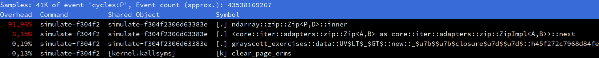

# An inlining puzzle

A major promise of C++, which was inherited by Rust, is that it should be
possible to write reasonably straightforward high-level code, which compiles
down to highly optimized machine code, by virtue of providing the compiler
optimizer with all the information it needs to remove the high-level abstraction
overhead at compile time.

Unfortunately, this promise comes with a footnote concerning function inlining:

- The process of turning high-level abstractions into efficient machine code
  vitally depends on a particular compiler optimization known as inline
  expansion or inlining. This optimization revolves around strategically copying
  and pasting the code of a function into its callers when it seems worthwhile,
  which enables many more optimizations down the line by letting the compiler
  specialize the function's code for the context in which it is being called.
- Compiler optimizers decide whether to inline a function or not based on
  heuristics, and sometimes the heuristics is wrong and decides not to inline a
  function which should be inlined. This can result in an enormous runtime
  performance penalty.

In our case, as a quick run through a profiler will tell you, the performance
problems that were observed at the end of the last chapter come from the fact
that the compiler did not inline some iterator-related functions that are key to
our code's performance.


## Available tools for inlining issues

When the function that is not inlined is a function that you wrote, there is
often an easy fix. Just annotate the function that fails to inline properly with
an
[`#[inline]`](https://doc.rust-lang.org/reference/attributes/codegen.html#the-inline-attribute).
This will adjust the compiler optimizer's cost model concerning this function,
and increase the odds that it does get inlined.

Most of the time, using `#[inline]` will be enough to restore inlining where it
should happen, and bring back the runtime performance that you would expect. But
unfortunately, `#[inline]` is just a hint, and the compiler's optimizer may
occasionally refuse to take the hint and insist that in its highly educated 
opinion, a function really should not be inlined.

For those difficult situations, Rust provides you with `#[inline(always)]`,
which is a much stronger hint that a function should **always** be inlined, even
in debug builds. Basically, if it is at all possible to inline a function that
is annotated with `#[inline(always)]`[^1], the compiler will inline it.

Unfortunately, while all of this is useful, it does not address one important
use case: what should you do when the function that fails to inline is not
defined in your code, but in a different library like one of your dependencies
or the standard library, as happens in our case?

When this happens, you basically have three options:

1. Get in touch with the developers of that library and try to get them to add
   `#[inline]` directives in the right place. This works, but can take a while,
   and may fail if the authors of the library are not convinced that most users
   need inlining for runtime performance.[^2]
2. Tweak the code in the hope of getting it into a shape that inlines better.
3. Roll your own version of the affected function(s), applying as much inlining
   directives as necessary to get the performance that you want.

For practical reasons[^3], this chapter will cover the last two options.


## Locating the bad inlining

The inlining failures that are killing our performance stick out in the output
of `perf report`.



There are two hot functions here that should be inlined into their caller, but
are not:

- The `next()` method of our zipped iterator over window elements and stencil
  weights. Failing to inline this will increase the cost of each loop iteration
  by some amount, since now iteration variables will need to be pushed to the
  stack and popped back when they could stay resident in CPU registers instead.
  This is already quite bad in such a tight loop.
- The `ndarray::zip::Zip::inner()` method that performs the iteration over
  zipped iterators and does the actual computation is the biggest problem,
  however. Failing to inline this function into its multi-versioned caller 
  breaks function multi-versioning, because the out-lined version will not be
  multiversioned. Therefore, it will only be compiled for the lowest denominator
  x86_64 SIMD instruction set of SSE2, which will cost us a lot of SIMD
  performance.

The first issue is actually surprisingly easy to resolve, once you know the
trick. Just replace the 1D-style flattened iterator that makes the compiler
optimizer choke with a version that separates the iteration over rows and
columns of data:

```rust,ignore
// We give up on this...
(win_u.into_iter())
    .zip(win_v)
    .zip(STENCIL_WEIGHTS.into_iter().flatten())

// ...and instead go for this:
(win_u.rows().into_iter())
    .zip(win_v.rows())
    .zip(STENCIL_WEIGHTS)
    .flat_map(|((u_row, v_row), weights_row)| {
        (u_row.into_iter().copied())
            .zip(v_row.into_iter().copied())
            .zip(weights_row)
    })
```

As it turns out, the compiler has an easier time inlining through two layers of
simple iteration than one layer of complex iteration, which is annoying but fair
enough.

The second issue, however, is more difficult to resolve. `ndarray`'s
producer-zipping code is quite complex because it tries to support arrays of
arbitrary dimensionality, storage backend, and layout. Therefore, the amount of
code that would need to be marked `#[inline]` would be quite large, and there is
a relatively high risk that upstream would reject an associated pull request
because it could have unforeseen side-effects on other code that calls
`ndarray::azip!()`.[^4]

Hence we are going to go for a different approach, and instead roll our own
4-arrays-zipping iterator that is specialized for our needs... and marked
`#[inline]` the way we want it.


## Introducing `unsafe`

A key design goal of Rust is that most of the code that you write should be
proven to be type-safe, memory-safe and thread-safe, either at compile time or
via runtime checks. For concision reasons, code that achieves the combination of
these three properties is referred to as "safe code".

Sadly, Rust cannot extend this proof to 100% of your code for two important
reasons:

- There are useful software operations whose correctness cannot be proven at
  compile-time. Think about, for example, calling into a third-party library
  that is implemented in C/++. Since code written in these languages is not
  proven to be safe at compile time and does not formally document its runtime
  safety invariants, there is no way for the Rust compiler to prove that such a
  function call is safe. Yet being able to interoperate with the existing
  ecosystem of C/++ code is a very important asset that most Rust programmers
  would not want to give up on.
- Runtime checks come at a runtime performance cost, unless they are eliminated
  by the compiler's optimizer. Unfortunately, compiler optimizers are not very
  good at this job, and it is very common for them to leave around runtime
  safety checks in situations where a human could easily prove that they will
  never be triggered. The associated performance cost may not be acceptable to
  programs with strict runtime performance requirements.

As a compromise, Rust therefore provides access to supplementary operations of
unproven safety, whose use is guarded by the `unsafe` keyword. They have various
uses, but for our purposes, the operations of highest interest will be those
that replicate standard library constructs that involve safety checks, but
without the safety checks. Instead of crashing the program at runtime on
erronerous usage, these unsafe operations will instead trigger undefined
behavior and let the compiler trash your program in unpredictable ways, like
most C/++ operations do.

The intended use of these `unsafe` operations is of course not to make Rust a
C/++-like undefined behavior free-for-all, turning all of the hard-earned
language safety guarantees into a fragile illusion that shatters on the first
use of the `unsafe` keyword. Instead, `unsafe` operations are meant to be used
inside of the implementation of safe operations, in order to do things that the
safe subset of the language cannot currently do due to compiler limitations,
like safely indexing into arrays at a known-good position without paying the
price of runtime bound checks.

As you may guess by now, the iterators of all basic collection types (arrays,
`Vec`s...) are implemented using unsafe code. And so are the iterators of
`ndarray`'s multidimensional arrays.

Of course, use of unsafe code is not without risks. The human proof backing the
implementation of safe operations may be wrong, and let the risk of Undefined
Behavior (UB) slip through, which is why frivolous use of `unsafe` is highly
frowned upon in the Rust community. In a nutshell, unsafe code authors must keep
in mind that...

- `unsafe` code should only be used in situations where there is no safe way to
  perform the task with acceptable runtime performance. The Rust community's
  tolerance for convoluted safe code that improve compiler optimizations through
  unnatural contortions is much higher than for `unsafe` code that could be
  safe.
- If a function is not marked as `unsafe`, there must be no combination of
  inputs that can lead to the emergence of undefined behavior when it is called.
- If a function is marked as `unsafe`, its documentation must clearly spell out
  the safety contract that must be followed to avoid undefined behavior. This is
  needed so that users of the unsafe function know how to correctly use it later
  on.


## An optimized iterator

This is an optimized version of our lockstep iteration pattern, implemented
using unsafe code:

```rust,ignore
use ndarray::{ArrayView2, ShapeBuilder};

/// Optimized iterator over stencil output locations and input windows
#[inline]
pub fn stencil_iter<'data, const SIMD_WIDTH: usize>(
    start: &'data UV<SIMD_WIDTH>,
    end: &'data mut UV<SIMD_WIDTH>,
) -> impl Iterator<
    Item = (
        ArrayView2<'data, Vector<SIMD_WIDTH>>, // <- Input u window
        ArrayView2<'data, Vector<SIMD_WIDTH>>, // <- Input v window
        &'data mut Vector<SIMD_WIDTH>,         // <- Output u
        &'data mut Vector<SIMD_WIDTH>,         // <- Output v
    ),
>
where
    LaneCount<SIMD_WIDTH>: SupportedLaneCount,
{
    // Assert that the sub-grids all have the same memory layout.
    // This means that what we learn about one is valid for the other.
    //
    // It is fine to have a bunch of runtime assertions in an iterator
    // constructor, because their cost will be amortized across all iterations.
    assert_eq!(start.u.shape(), start.v.shape());
    assert_eq!(start.u.shape(), end.u.shape());
    assert_eq!(start.u.shape(), end.v.shape());
    assert_eq!(start.u.strides(), start.v.strides());
    assert_eq!(start.u.strides(), end.u.strides());
    assert_eq!(start.u.strides(), end.v.strides());

    // Collect and check common layout information
    let in_shape = start.simd_shape();
    assert!(in_shape.into_iter().min().unwrap() >= 2);
    let strides = start.u.strides();
    assert_eq!(strides.len(), 2);
    assert!(strides.iter().all(|stride| *stride > 0));
    let [row_stride, col_stride] = [strides[0] as usize, strides[1] as usize];
    assert_eq!(col_stride, 1);

    // Select the center of the simulation domain
    let out_shape = in_shape.map(|dim| dim - 2);
    let out_slice = s![1..=out_shape[0], 1..out_shape[1]];
    let mut out_u = end.u.slice_mut(out_slice);
    let mut out_v = end.v.slice_mut(out_slice);
    assert_eq!(start.u.strides(), out_u.strides());
    assert_eq!(start.u.strides(), out_v.strides());
    let [out_rows, out_cols] = out_shape;

    // Determine how many elements we must skip in order to go from the
    // past-the-end element of one row to the first element of the next row.
    let next_row_step = row_stride - out_cols;

    // Prepare a way to access input windows and output refs by output position
    // The safety of the closures below is actually asserted on the caller's
    // side, but sadly unsafe closures aren't a thing in Rust yet.
    let stencil_shape = [STENCIL_WEIGHTS.len(), STENCIL_WEIGHTS[0].len()];
    let window_shape = (stencil_shape[0], stencil_shape[1]).strides((row_stride, 1));
    let unchecked_output = move |out_ptr: *mut Vector<SIMD_WIDTH>| unsafe { &mut *out_ptr };
    let unchecked_input_window = move |in_ptr: *const Vector<SIMD_WIDTH>| unsafe {
        ArrayView2::from_shape_ptr(window_shape, in_ptr)
    };

    // Recipe to emit the currently selected input windows and output references,
    // then move to the next column. As before, this is only safe if called with
    // correct element pointers.
    let emit_and_increment =
        move |in_u_ptr: &mut *const Vector<SIMD_WIDTH>,
              in_v_ptr: &mut *const Vector<SIMD_WIDTH>,
              out_u_ptr: &mut *mut Vector<SIMD_WIDTH>,
              out_v_ptr: &mut *mut Vector<SIMD_WIDTH>| unsafe {
            let win_u = unchecked_input_window(*in_u_ptr);
            let win_v = unchecked_input_window(*in_v_ptr);
            let out_u = unchecked_output(*out_u_ptr);
            let out_v = unchecked_output(*out_v_ptr);
            *in_u_ptr = in_u_ptr.add(1);
            *in_v_ptr = in_v_ptr.add(1);
            *out_u_ptr = out_u_ptr.add(1);
            *out_v_ptr = out_v_ptr.add(1);
            (win_u, win_v, out_u, out_v)
        };

    // Set up iteration state
    let mut in_u_ptr = start.u.as_ptr();
    let mut in_v_ptr = start.v.as_ptr();
    let mut out_u_ptr = out_u.as_mut_ptr();
    let mut out_v_ptr = out_v.as_mut_ptr();
    //
    // End of the current row processed by out_v_ptr
    let mut out_v_row_end = unsafe { out_v_ptr.add(out_cols) };
    //
    // End of the last row of the output grid
    let out_v_end = unsafe { out_v_row_end.add(out_rows.saturating_sub(1) * row_stride) };

    // Emit output iterator
    std::iter::from_fn(move || {
        // Common case : we are within the bounds of a row and advance normally
        if out_v_ptr < out_v_row_end {
            return Some(emit_and_increment(
                &mut in_u_ptr,
                &mut in_v_ptr,
                &mut out_u_ptr,
                &mut out_v_ptr,
            ));
        }

        // Otherwise, check if we reached the end of iteration
        if out_v_ptr == out_v_end {
            return None;
        }

        // We're at the end of a row, but not at the end of iteration:
        // switch to the next row then emit the next element as usual
        debug_assert_eq!(out_v_ptr, out_v_row_end);
        unsafe {
            in_u_ptr = in_u_ptr.add(next_row_step);
            in_v_ptr = in_v_ptr.add(next_row_step);
            out_u_ptr = out_u_ptr.add(next_row_step);
            out_v_ptr = out_v_ptr.add(next_row_step);
            out_v_row_end = out_v_ptr.add(out_cols);
        }
        Some(emit_and_increment(
            &mut in_u_ptr,
            &mut in_v_ptr,
            &mut out_u_ptr,
            &mut out_v_ptr,
        ))
    })
}
```

We do not have the time to cover how it works in detail, but in a nutshell, it
is the same code that the iterator zip in our optimized SIMD implementation
should compile down to, and unlike the iterator zip, we wrote it and therefore
can put a hard-earned `#[inline]` directive on it.


## Exercise

Integrate these two iterator inlining optimizations into your code, and measure
their effect on runtime performance. It should now be more in line (heh heh)
with what you would expect considering the work that was put into SIMD layout
improvements in the last chapter.

There is a lesson to be learned here: when an optimization does not have the
payoff that you would expect, do not conclude that it is bad right away.
Instead, take the time to figure out what's going on, and whether your
optimization is truly working as intended.


---

[^1]: It is not always possible to inline function calls due to annoying edge
      cases like recursion.

[^2]: This is why language and compiler authors should really get their act
      together and complement function-level inlining directives with more
      flexible call site inlining directives. But to the author's knowledge,
      only `clang` has provided a basic matching C extension to this day. Here
      are some possible reasons why:
      - Compiler optimizer codebases tend to be _very_ messy and understaffed,
        and extending them with a new optimization hint can take an unexpected
        amount of refactoring work.
      - At the programming language level, designing good syntax for annotating
        individual function calls is not as easy as it seems, because modern
        programming languages feature many constructs that call functions but do
        not look like function calls, including any kind of operator
        overloading. And there are other interesting programming language design 
        questions concerning how you would hint about transitive inlining beyond
        one directly annotated function call.

[^3]: We do not want you to accidentally DDoS some poor open source maintainers
      with hundreds of issues and pull requests and wait for them to sort
      through the duplicate reports during the entire school.

[^4]: There is a reason why sane compilers do not inline all function calls by
      default. Inlining means duplicating compilation work, which will have
      consequences in terms of compilation time and RAM consumption. It
      increases code size, which can cause I-cache problems at runtime. And by
      making caller functions too large, it can trigger other optimizer
      heuristics that tune down the amount of optimizations that is performed on
      the caller function. Basically, inlining is a tradeoff: it is very useful
      in the right place, but it can easily do more harm than good in the wrong
      place. Which is why it is very annoying that most compilers and
      programming languages only provide callee-side inlining hints at this
      point in time.
