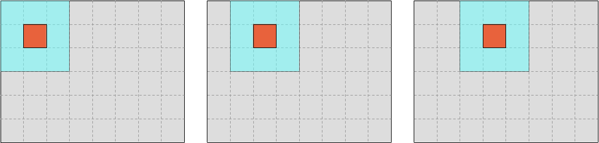
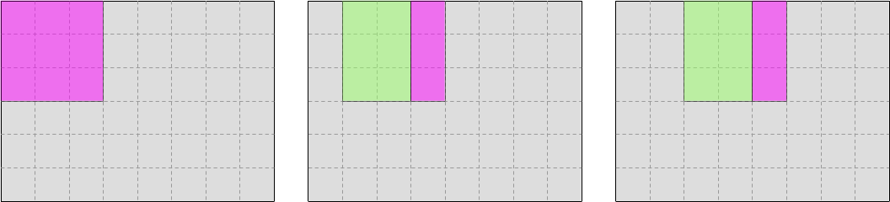
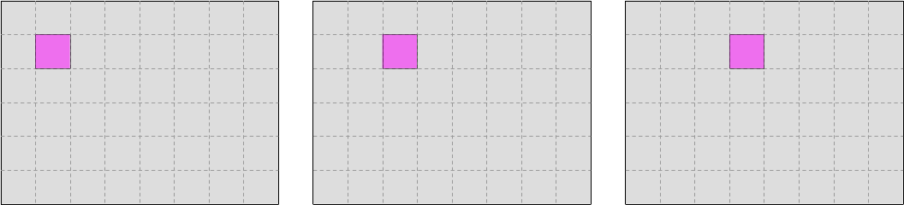
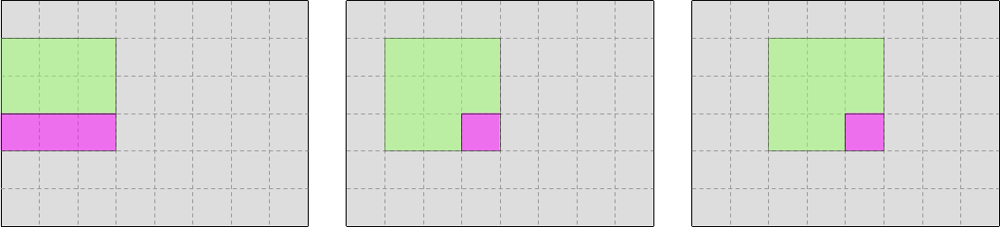
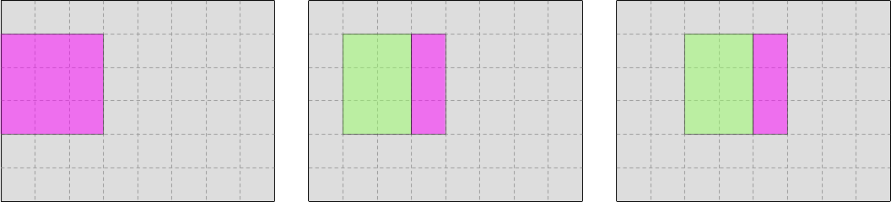
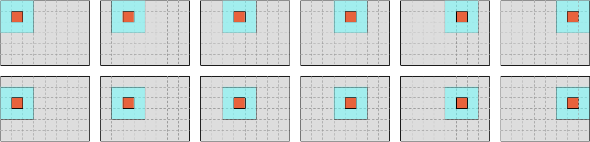
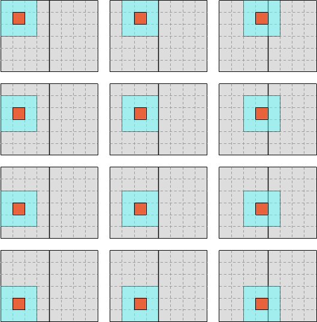
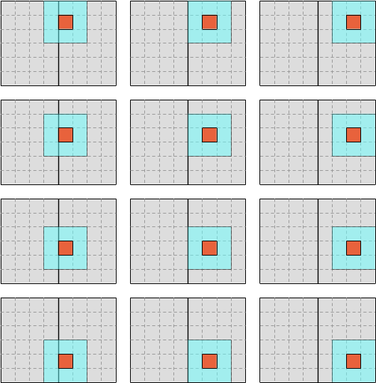

# Cache blocking

> **Warning:** Although the optimizations described in this section were useful
> on older Intel CPUs, they do not seem to be beneficial anymore since the
> Skylake generation, likely because the L2 cache of Intel CPUs got smart enough
> to handle things on its own in this relatively simple simulation.
>
> However, in more complex computations, the need for this sort of optimization
> keeps coming up regularly even on newer CPUs. Hence we keep the chapter around
> so that you can still get a feeling of how it's done on a simpler codebase.

If we run our latest version through `perf stat -d`, we will see that above a
certain problem size, it seems to be slowed down by memory access issues:

```text
$ perf stat -d -- cargo bench --bench simulate -- --profile-time=10 1024x

    Finished `bench` profile [optimized + debuginfo] target(s) in 0.05s
     Running benches/simulate.rs (target/release/deps/simulate-f304f2306d63383e)
Gnuplot not found, using plotters backend
Benchmarking simulate/1024x1024: Complete (Analysis Disabled)


 Performance counter stats for 'cargo bench --bench simulate -- --profile-time=10 1024x':

         15 457,63 msec task-clock                       #    1,000 CPUs utilized             
                45      context-switches                 #    2,911 /sec                      
                 0      cpu-migrations                   #    0,000 /sec                      
            16 173      page-faults                      #    1,046 K/sec                     
    66 043 605 917      cycles                           #    4,273 GHz                         (50,05%)
    32 277 621 790      instructions                     #    0,49  insn per cycle              (62,55%)
     1 590 473 709      branches                         #  102,892 M/sec                       (62,56%)
         4 078 658      branch-misses                    #    0,26% of all branches             (62,52%)
     6 694 606 694      L1-dcache-loads                  #  433,094 M/sec                       (62,50%)
     1 395 491 611      L1-dcache-load-misses            #   20,85% of all L1-dcache accesses   (62,46%)
       197 653 531      LLC-loads                        #   12,787 M/sec                       (49,97%)
         2 226 645      LLC-load-misses                  #    1,13% of all LL-cache accesses    (50,01%)

      15,458909585 seconds time elapsed

      15,411864000 seconds user
       0,047092000 seconds sys
```

Indeed, 20% of our data accesses miss the L1 data cache, and possibly as a
result, the CPU only executes one SIMD instruction every two clock cycles. Can
we improve upon this somehow?


## Visualizing the problem

Recall that our memory access pattern during iteration looks like the following
schematic, where the outer blue-colored square represents SIMD vectors that are
being read and the inner red-colored square represents SIMD vectors that are
being written:



There is, however, a more hardware-centered way to study this pattern, which is
to investigate which SIMD vectors must be brought into the L1 CPU cache at each
step of the computation, and which SIMD vectors can be reused from previous
steps.

For simplicity, we will draw our schematics as if cache lines did not exist and
CPUs truly loaded or stored one single SIMD vector whenever we ask them to do
so.

In the case of input data, the pattern looks like this, where pink represents
data that is newly brought into the CPU cache, and green represents data that
can be reused from previous iterations:



And in the case of output data, the pattern looks like this:



So far so good. As long as we are generating the first row of output data, there
is no way to improve upon this pattern. The CPU cache is working as intended,
speeding up at least 2/3 of our memory accesses, and it actually helps even more
than this when more advanced cache features like hardware prefetching are taken
into account.

The question is, what will happen when we reach the second row of output data?
Can we reuse the data that we loaded when processing the first row of data, like
this?



Or do we need to load everything again from RAM or a lower-level cache, like
this?



The answer to this question actually depends on how many columns our simulation
domain has:

- If the simulation domain has few columns, then by the time we start processing
  the second row of output, the input data will still be fresh in the L1 CPU
  cache and can efficiently be reused.
- But if the simulation domain has many columns, by the time we get to the
  second row, the input data from the beginning of the first row will have been
  silently dropped by the L1 CPU cache, and we will need to slowly reload it
  from RAM or a lower-level CPU cache.

We can estimate where the limit lies using relatively simple math:

- Let use denote `S` the size of the L1 CPU cache in bytes and `C` the width of
  the simulation domain in scalar columns.
- In our optimized SIMD data layout, rows of data are padded by 1 SIMD vector of
  zeros on both sides, so we actually have `K = C + 2 * W` scalar data columns in
  our internal tables, where `W` is our SIMD vector width.
- To produce a row of output, we must read `3 * K` data points from the two
  input tables representing the starting concentrations of species U and V, and
  we must write `K - 2 * W = C` data points to the two matching output tables.
- Each data point is a number of type `Float`, which is currently configured to
  be of type `f32`. Therefore, a `Float` is currently 4 bytes.
- So overall, the CPU cache footprint that is associated while reading input for
  an entire row is `2 * (3 * K) * 4 = 24 * K` bytes and the CPU cache footprint
  that is associated with writing output for an entire row is `2 * C * 4 = 8 *
  C` bytes.
- By combining these two expressions, it follows that the total CPU cache
  footprint associated with producing one row of output is `24 * K + 8 * C`
  bytes. Which, if we inject the value of `K` into the expression, translates
  into `32 * C + 48 * W` bytes.
- For optimal performance, we would like all this data to fit in L1 cache, so
  that input data is still accessible by the time we start processing the second
  row, knowing that we need some headroom for other things that go into the L1
  cache like constant data. So overall we would like to have `32 * C + 48 * W <
  S`.
- And because we are actually interested in the maximal value of `C`, we rewrite
  this expression into the mathematically equivalent `C < (S - 48  * W) / 32`.

By injecting concrete values of `S` and `W` into this expression, we get a 
maximal value of `C` for which a given CPU can operate at optimal L1 cache
efficiency.

For example, if we consider an Intel i9-10900 CPU with 32 KiB of L1d cache and
256-bit AVX vectors, the limit of L1d cache capacity is reached when the
simulation domain has around 976 columns (not accounting for other data which
must fit in L1d cache). And unsurprisingly, this does indeed match the point
where our microbenchmark's performance drops.

So far so good, we have a theoretical model that is good enough to model the
issue. Let us now use it to improve L1 cache hit rates at larger problem sizes!


## The loop blocking trick

So far, we have used a simple iteration scheme where we fully iterate over each
row of output concentrations, before moving to the next one:



It doesn't have to be that way however. We could use a different scheme where we
slice our data into a number of vertical blocks, and iterate over each vertical 
block before moving to the next one.

For example, we could first iterate over the left half of the data like this...

<center>



</center>

...and then iterate over the right half like this:

<center>



</center>

The computation is not sensitive to the order in which data points are computed,
so this change of iteration order will not affect the results. What it will do,
however, is to reduce the number of columns that are traversed before the
computation moves to the next line, ideally ensuring that a large computation
which did not fully leverage the CPU's L1 cache before is now able to do so.

How wide should the blocks be? Well, there is a trade-off there. On one hand,
CPUs work best when they are processing long, uninterrupted sequences of
contiguous data, and from this perspective longer rows of data are better. On
the other hand, the whole point of this chapter is to show you that long row
lengths can be problematic for L1d cache locality. Taken together, these two
statements entail that we should strive to make our blocks should as wide as
available L1d cache capacity will allow, but no wider.

Which is where the simple theoretical model that we derived previously comes
into play: using it, we will be able to determine how wide blocks could ideally
be, assuming that the L1d cache were fully available for simulation data. We
will then shrink this estimate using an empirically tuned safety factor in order
to leave some L1d cache headroom for other program state (like constants) and
CPU memory subsystem black magic like prefetches. And this is how we will get
our optimal block width.


## Determining the block width

Recall that our simple theoretical model gives us an `C < (S - 48  * W) / 32`
bound on block width, where `S` is the size of the L1d cache and `W` is our SIMD
vector width. We already have seen how one can query the SIMD vector width. But
where are we supposed to find out how large the L1d cache is, given that it
depends on your CPU, and sometimes even on the core where you are executing?[^1]

In a C program, the easiest way to query the cache layout of your CPU would be
to use the excellent [`hwloc`](https://www.open-mpi.org/projects/hwloc/)
library, which abstracts over hardware and OS specifics and gives you an easy
and portable way to query CPU topology information. But since we are doing Rust,
using `hwloc` directly will involve some unpleasant and unidiomatic unsafe
constructs.

Therefore, my recommendation will instead be for you to use
[`hwlocality`](https://docs.rs/hwlocality/latest/hwlocality/), a safe binding
that I wrote on top of `hwloc` in order to make it easier to use from Rust.

We start by adding it to our project via a now familiar procedure...[^2]

```bash
cargo add hwlocality
```

And then, inside of our code, we can easily use it to find the minimum
L1d cache size across all available CPU cores:

```rust,ignore
use hwlocality::Topology;

let topology = Topology::new().expect("Failed to query hwloc topology");
let cache_stats = topology
    .cpu_cache_stats()
    .expect("Failed to probe CPU cache stats");
let l1d_size = cache_stats.smallest_data_cache_sizes()[0];
```

From this, we can deduce an upper bound on the optimal block width...

```rust,ignore
let l1d_size = smallest_l1d_cache_size();
let float_size = std::mem::size_of::<Float>();
let max_scalar_block_width = (l1d_size as usize - 12 * float_size * simd_width) / (8 * float_size);
```

...convert it to a number of SIMD vectors to account for our actual data layout...

```rust,ignore
let max_simd_block_width = max_scalar_block_width / simd_width;
```

...and shrink it down by a safety factor (that we will late tune through
microbenchmarking) in order to account for other uses of the L1d cache that our
simple theoretical model does not cover:

```rust,ignore
// FIXME: Adjust this safety factor through microbenchmarking
let ideal_simd_block_width = (max_simd_block_width as f32 * 0.8) as usize
```

Putting it all together, we get this function:

```rust,ignore
/// Determine the optimal block size of the computation
pub fn simd_cols_per_block(simd_width: usize) -> usize {
    let topology = Topology::new().expect("Failed to query hwloc topology");
    let cache_stats = topology
        .cpu_cache_stats()
        .expect("Failed to probe CPU cache stats");
    let l1d_size = cache_stats.smallest_data_cache_sizes()[0];

    let float_size = std::mem::size_of::<Float>();
    let max_scalar_block_width =
        (l1d_size as usize - 12 * float_size * simd_width) / (8 * float_size);
    let max_simd_block_width = max_scalar_block_width / simd_width;

    // FIXME: Adjust this safety factor through microbenchmarking
    (max_simd_block_width as f32 * 0.8) as usize
}
```

One thing to bear in mind here is that although the code may look innocent
enough, computing the block size involves some relatively expensive operations
like querying the CPU's memory subsystem topology from the OS. So we should not
do it on every call to the `update()` function. Instead, it should be computed
once during simulation initialization and kept around across `update()` calls.


## Block-wise iteration

Now that we have a block size, let's slice up our computation domain into actual
blocks.

We start by adding a parameter to our update method so that the caller can pass
in the precalculated chunk size.

```rust,ignore
pub fn update<const SIMD_WIDTH: usize>(
    opts: &UpdateOptions,
    start: &UV<SIMD_WIDTH>,
    end: &mut UV<SIMD_WIDTH>,
    cols_per_block: usize,  // <- This is new
) where
    LaneCount<SIMD_WIDTH>: SupportedLaneCount,
{
    // TODO: Implementation
}
```

Then we extract the center of the output array and we slice it up into
non-overlapping chunks:

```rust,ignore
use ndarray::Axis;

let center_shape = end.simd_shape().map(|dim| dim - 2);
let center = s![1..=center_shape[0], 1..=center_shape[1]];
let mut end_u_center = end.u.slice_mut(center);
let mut end_v_center = end.v.slice_mut(center);
let end_u = end_u_center.axis_chunks_iter_mut(Axis(1), cols_per_block);
let end_v = end_v_center.axis_chunks_iter_mut(Axis(1), cols_per_block);
```

So far, `ndarray` makes life easy for us. But unfortunately, it does not have an
axis iterator that matches the semantics that we have for input windows, and
therefore we are going to need to hack it using careful indexing.

We start by iterating over output blocks, using `enumerate()` and a counter of
blocks to tell when we are going to reach the last block (which may be narrower
than the other blocks)..

```rust,ignore
let num_blocks = center_shape[1].div_ceil(cols_per_block);
for (idx, (end_u, end_v)) in end_u.zip(end_v).enumerate() {
    let is_last = idx == (num_blocks - 1);

    // TODO: Process one output block here
}
```

...and then we slice up input blocks of the right size:

```rust,ignore
use ndarray::Slice;

let input_base = idx * cols_per_block;
let input_slice = if is_last {
    Slice::from(input_base..)
} else {
    Slice::from(input_base..input_base + cols_per_block + 2)
};
let start_u = start.u.slice_axis(Axis(1), input_slice);
let start_v = start.v.slice_axis(Axis(1), input_slice);
```

At this point, we have correctly sized `start_u`, `start_v`, `end_u` and `end_v`
blocks. But our `stencil_iter()` function cannot accept them yet because the
code has so far been specialized to take full `UV` structs as input, and cannot
handle chunks of the simulation domain yet.

I will spare you the required code adjustments since the fine art of
generalizing `unsafe` Rust code without compromizing its safety is beyond
the scope of this short course. But in the end we get this:

```rust,ignore
use ndarray::ArrayViewMut2;

#[inline]
pub fn stencil_iter<'data, const SIMD_WIDTH: usize>(
    start_u: ArrayView2<'data, Vector<SIMD_WIDTH>>,
    start_v: ArrayView2<'data, Vector<SIMD_WIDTH>>,
    mut end_u_center: ArrayViewMut2<'data, Vector<SIMD_WIDTH>>,
    mut end_v_center: ArrayViewMut2<'data, Vector<SIMD_WIDTH>>,
) -> impl Iterator<
    Item = (
        ArrayView2<'data, Vector<SIMD_WIDTH>>, // <- Input u window
        ArrayView2<'data, Vector<SIMD_WIDTH>>, // <- Input v window
        &'data mut Vector<SIMD_WIDTH>,         // <- Output u
        &'data mut Vector<SIMD_WIDTH>,         // <- Output v
    ),
>
where
    LaneCount<SIMD_WIDTH>: SupportedLaneCount,
{
    // Assert that the sub-grids all have the expected memory layout.
    assert_eq!(start_u.shape(), start_v.shape());
    assert_eq!(end_u_center.shape(), end_v_center.shape());
    assert_eq!(start_u.shape().len(), 2);
    assert_eq!(end_u_center.shape().len(), 2);
    assert!(start_u
        .shape()
        .iter()
        .zip(end_u_center.shape())
        .all(|(start_dim, end_dim)| *start_dim == end_dim + 2));
    assert_eq!(start_u.strides(), start_v.strides());
    assert_eq!(start_u.strides(), end_u_center.strides());
    assert_eq!(start_u.strides(), end_v_center.strides());

    // Collect and check common layout information
    let in_shape = [start_u.shape()[0], start_u.shape()[1]];
    assert!(in_shape.into_iter().min().unwrap() >= 2);
    let strides = start_u.strides();
    assert_eq!(strides.len(), 2);
    assert!(strides.iter().all(|stride| *stride > 0));
    let [row_stride, col_stride] = [strides[0] as usize, strides[1] as usize];
    assert_eq!(col_stride, 1);
    let [out_rows, out_cols] = in_shape.map(|dim| dim - 2);

    // Determine how many elements we must skip in order to go from the
    // past-the-end element of one row to the first element of the next row.
    let next_row_step = row_stride - out_cols;

    // Prepare a way to access input windows and output refs by output position
    // The safety of the closures below is actually asserted on the caller's
    // side, but sadly unsafe closures aren't a thing in Rust yet.
    let stencil_shape = [STENCIL_WEIGHTS.len(), STENCIL_WEIGHTS[0].len()];
    let window_shape = (stencil_shape[0], stencil_shape[1]).strides((row_stride, 1));
    let unchecked_output = move |out_ptr: *mut Vector<SIMD_WIDTH>| unsafe { &mut *out_ptr };
    let unchecked_input_window = move |in_ptr: *const Vector<SIMD_WIDTH>| unsafe {
        ArrayView2::from_shape_ptr(window_shape, in_ptr)
    };

    // Recipe to emit the currently selected input windows and output references,
    // then move to the next column. As before, this is only safe if called with
    // correct element pointers.
    let emit_and_increment =
        move |in_u_ptr: &mut *const Vector<SIMD_WIDTH>,
              in_v_ptr: &mut *const Vector<SIMD_WIDTH>,
              out_u_ptr: &mut *mut Vector<SIMD_WIDTH>,
              out_v_ptr: &mut *mut Vector<SIMD_WIDTH>| unsafe {
            let win_u = unchecked_input_window(*in_u_ptr);
            let win_v = unchecked_input_window(*in_v_ptr);
            let out_u = unchecked_output(*out_u_ptr);
            let out_v = unchecked_output(*out_v_ptr);
            *in_u_ptr = in_u_ptr.add(1);
            *in_v_ptr = in_v_ptr.add(1);
            *out_u_ptr = out_u_ptr.add(1);
            *out_v_ptr = out_v_ptr.add(1);
            (win_u, win_v, out_u, out_v)
        };

    // Set up iteration state
    let mut in_u_ptr = start_u.as_ptr();
    let mut in_v_ptr = start_v.as_ptr();
    let mut out_u_ptr = end_u_center.as_mut_ptr();
    let mut out_v_ptr = end_v_center.as_mut_ptr();
    //
    // End of the current row processed by out_v_ptr
    let mut out_v_row_end = unsafe { out_v_ptr.add(out_cols) };
    //
    // End of the last row of the output grid
    let out_v_end = unsafe { out_v_row_end.add(out_rows.saturating_sub(1) * row_stride) };

    // Emit output iterator
    std::iter::from_fn(move || {
        // Common case : we are within the bounds of a row and advance normally
        if out_v_ptr < out_v_row_end {
            return Some(emit_and_increment(
                &mut in_u_ptr,
                &mut in_v_ptr,
                &mut out_u_ptr,
                &mut out_v_ptr,
            ));
        }

        // Otherwise, check if we reached the end of iteration
        if out_v_ptr == out_v_end {
            return None;
        }

        // We're at the end of a row, but not at the end of iteration:
        // switch to the next row then emit the next element as usual
        debug_assert_eq!(out_v_ptr, out_v_row_end);
        unsafe {
            in_u_ptr = in_u_ptr.add(next_row_step);
            in_v_ptr = in_v_ptr.add(next_row_step);
            out_u_ptr = out_u_ptr.add(next_row_step);
            out_v_ptr = out_v_ptr.add(next_row_step);
            out_v_row_end = out_v_ptr.add(out_cols);
        }
        Some(emit_and_increment(
            &mut in_u_ptr,
            &mut in_v_ptr,
            &mut out_u_ptr,
            &mut out_v_ptr,
        ))
    })
}
```

Basically, where we used to slice the center of the output ourselves, the caller
is now responsible for doing it, and the rest is similar as slicing an N-d
array does not affect the memory stride from one row to the next, which is the
main low-level layout information that we rely on here.


## Exercise

Integrate this loop blocking optimization into the code. Note that this will
require some changes to the `run_simulation` function.

Then microbenchmark the code, and adjust the security factor in the
implementation of `simd_cols_per_block` to see how it affects
performance. The results may surprise you![^3]


---

[^1]: As seen in power efficiency focused CPUs like Arm big.LITTLE and Intel
      Adler Lake.

[^2]: Before it works, however, you will need to also ensure that your Linux
      distribution's equivalent of Ubuntu and Debian's `libhwloc-dev` package is
      installed. Unfortunately, C dependency management is not quite at the same
      level of convenience as Rust's `cargo add`...

[^3]: ...and in fact, I am still suspicious of them myself, and would like to
      spend more time analyzing them later on. Something for a future edition of
      this school?
